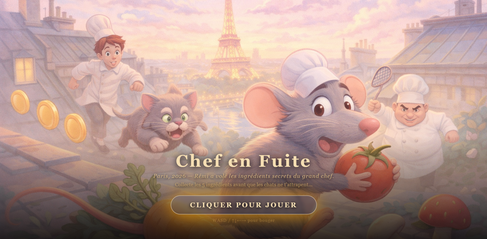
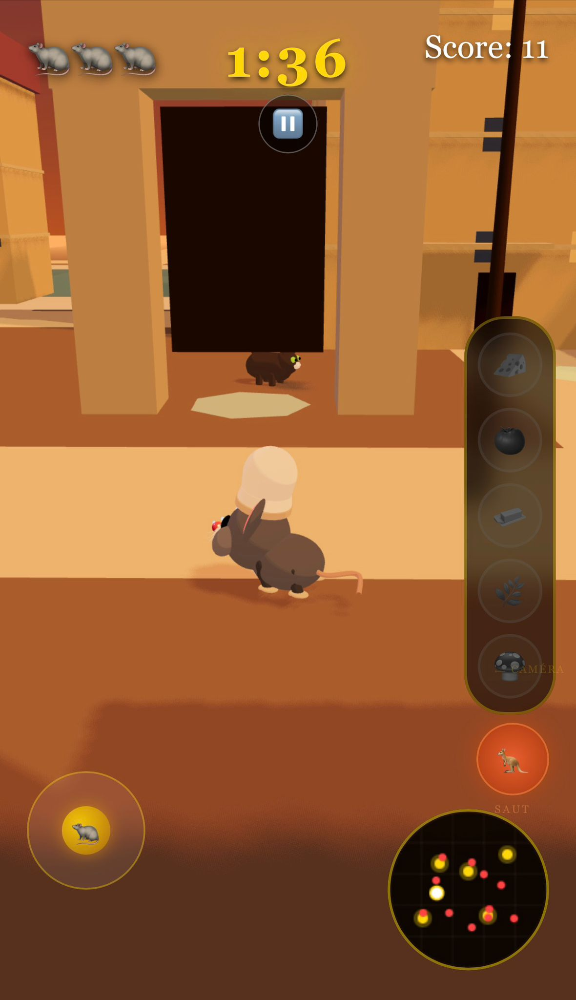

# 🐀 Chef en Fuite - Ratatouille: The WebGL Experience

> *Paris, 2026. Rémi, rat cuisinier de génie, a une seule chance de prouver son talent.*

[](https://soukainanadir.github.io/ratatouille-in-paris/)
[](https://threejs.org)
[](https://www.typescriptlang.org)
[](LICENSE)

---



---

## 🎬 Description

**Chef en Fuite** est un mini-jeu WebG, inspiré du film *Ratatouille* de Pixar, développé avec THREE.js et TypeScript. Le joueur incarne **Rémi**, un rat chef cuisinier, qui doit collecter **5 ingrédients** dissimulés dans les rues de Paris avant que le temps ne s'écoule, tout en évitant les chats gardiens.

---

## 🎯 Objectif

Collecter les 5 ingrédients secrets (🧀 🍅 🧈 🌿 🍄) cachés dans la carte de Paris avant la fin du chronomètre de **2 minutes**, sans se faire attraper par les chats gardiens.

Chaque ingrédient collecté rapporte des **points bonus**. Le score final est calculé selon la rapidité et le nombre de vies restantes.

---

## 🕹️ Mode d'emploi

### Contrôles — Clavier
| Touche | Action |
|--------|--------|
| `W` / `↑` | Avancer |
| `S` / `↓` | Reculer |
| `A` / `←` | Aller à gauche |
| `D` / `→` | Aller à droite |
| `ESPACE` | Sauter |
| `Souris` | Orienter la caméra |
| `ESC` | Pause / Reprendre |

### Contrôles — Mobile
- **Joystick virtuel** (bas gauche) : déplacement
- **Zone droite de l'écran** : rotation de la caméra
- **Bouton SAUT** (bas droite) : sauter

### Règles
- Collecte les **5 ingrédients** avant la fin du timer ⏱️
- Tu disposes de **3 vies** ❤️❤️❤️ — chaque contact avec un chat en retire une
- Si tu perds toutes tes vies ou si le temps s'écoule → **Game Over**
- Collecte tout à temps → **Victoire !**

---

## 📸 Aperçu

### 🖥️ Desktop


### 📱 Mobile


---

## 🏗️ Architecture technique
```
src/
├── engine/
│   ├── GameEngine.ts       # Boucle principale, états du jeu, caméra
│   ├── PhysicsWorld.ts     # Intégration Cannon-es
│   └── SoundManager.ts     # Audio spatial & musique
├── entities/
│   ├── Rat.ts              # Personnage joueur (mesh procédural, physique)
│   ├── Cat.ts              # IA ennemie (patrol / chase / search)
│   └── Ingredient.ts       # Collectibles avec particules
├── map/
│   └── ParisMap.ts         # Carte Paris procédurale (bâtiments, fontaine, arbres)
├── controls/
│   └── MobileJoystick.ts   # Joystick tactile responsive
└── ui/
    └── HUD.ts              # Interface (timer, vies, inventaire, score)
```

---

## ✨ Fonctionnalités implémentées

### 🎮 Gameplay
- Personnage joueur avec **physique Cannon-es** : gravité, sauts, collisions
- **5 ingrédients** flottants avec animations sinusoïdales et particules orbitales
- **Chronomètre** 2 minutes, système de vies, score dynamique
- États de jeu : intro → playing → pause → win/lose avec transitions fluides
- **Difficulté progressive** : les chats accélèrent à chaque ingrédient collecté

### 🐱 IA des chats (machine à états)
- **Patrol** : patrouille sur des routes prédéfinies
- **Chase** : poursuite active si le joueur est détecté (cône de vision 120°, portée ~7u)
- **Search** : rotation sur place après avoir perdu la trace
- **Alert** : réaction aux signaux d'alerte entre chats
- Bulles de dialogue contextuelles (*"J'AI VU LE RAT !"*, *"OÙ EST-IL ?!"*)

### 🗺️ Carte Paris procédurale (GIS)
- Quartier parisien : fontaine centrale, lampadaires, bâtiments haussmanniens
- Arbres, ruelles, zones d'embuscade
- **Instancing** via `mergeGeometries` pour les performances

### 🎨 Rendu
- **MeshToonMaterial** pour un style cartoon/Pixar cohérent
- **Ombres PCF** dynamiques
- **Brouillard** atmosphérique
- **ACESFilmic tone mapping** pour un rendu cinématique
- **Particules** sur les collectibles et effets de collecte

### 🎵 Audio
- **Musique de fond** : menu et in-game
- **Sons spatiaux** : miaulements via `THREE.PositionalAudio` (s'intensifient à l'approche)
- Toggle son avec la touche `M`

### 📱 Mobile / AR-Ready
- Joystick virtuel multi-touch
- Zone caméra dédiée (côté droit)
- Responsive toutes résolutions
- Architecture préparée pour WebXR / AR

### ⚡ Performance
- `THREE.Timer` (compatible THREE.js 0.183+)
- `mergeGeometries` pour instancing des géométries statiques
- `devicePixelRatio` limité à 2×
- Chargement asynchrone (`async/await`)

### 🎬 Animations (TWEEN.js)
- Animation cinématique de caméra à l'intro
- Transitions collect, damage, win/lose
- Animations procédurales du rat (marche, course, queue)

---

## 🚀 Installation & lancement

### Prérequis
- [Node.js](https://nodejs.org) ≥ 20
- npm ≥ 10

### Commandes
```bash
npm install       # Installer les dépendances
npm run dev       # Lancer en développement (live reload)
npm run build     # Build pour production
```

Disponible sur `http://localhost:5173` après `npm run dev`.

---

## 🌐 Hébergement GitHub Pages

1. Activer GitHub Pages → Settings → Source : **GitHub Actions**
2. Le workflow `.github/workflows/deploy.yml` build et déploie automatiquement à chaque push sur `main`
3. Live : **https://soukainanadir.github.io/ratatouille-in-paris/**

---

## 📚 Sources & inspirations

### Exemples THREE.js
- [How to make a game](https://threejs.org/manual/#en/game) — architecture boucle de jeu
- [Fundamentals](https://threejs.org/manual/#en/fundamentals) — base du scenegraph
- [PositionalAudio](https://threejs.org/examples/#webaudio_orientation) — spatialisation audio
- [Shadow](https://threejs.org/examples/#webgl_shadowmap) — ombres PCF
- [mergeGeometries](https://threejs.org/examples/#webgl_buffergeometry_instancing) — performance

### Librairies
- [THREE.js](https://threejs.org) r183
- [Cannon-es](https://github.com/pmndrs/cannon-es) — moteur physique
- [@tweenjs/tween.js](https://github.com/tweenjs/tween.js) — animations
- [Vite](https://vitejs.dev) — bundler
- [TypeScript](https://www.typescriptlang.org)

### 🎨 Modèles 3D
- [Eiffel Tower](https://poly.pizza/m/SM-Eiffel-Tower) by Scott Marshall — Poly Pizza 

### Template
- [fdoganis/three_vite_ts](https://github.com/fdoganis/three_vite_ts) — par Fivos Doganis (ENSG)

### 🎵 Audio
- [Incompetech](https://incompetech.com) — *Meanwhile in Bavaria* & *Parisian* par Kevin MacLeod
- [Pixabay](https://pixabay.com/sound-effects/) — effets sonores libres de droits
- [Freesound](https://freesound.org) — sons Creative Commons
- [ZzFX](https://killedbyapixel.github.io/ZzFX/) — bruitages procéduraux

### Inspiration
- *Ratatouille* (Pixar, 2007) — univers, personnages, thème culinaire parisien

---

## 📄 Licence

MIT — voir [LICENSE](LICENSE)

---

## 👩‍💻 Auteur

**Soukaina Nadir** — M2 TSI Géodata, ENSG Paris 2026  
Projet réalisé dans le cadre du cours **Web 3D** de Fivos Doganis.

> *"Tout le monde peut cuisiner."* — Gusteau
